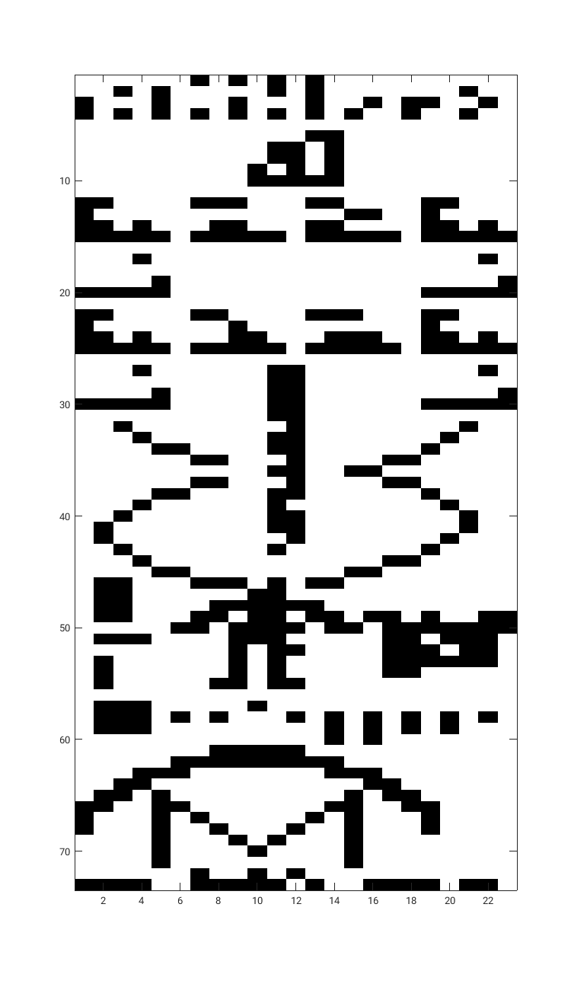

# arecibo_message

Method 1 of `analysis.m` produces the following pixel result (after inverting values for booleans):

  

Up for improvement: the thresholding of the binarization process after normalizing the demodulated signal. Currently the criteria is 1 standard deviation away from the median.
Method three offers an interesting idea to the discussion: shifting the signal down to baseband. However, obtaining clean signals from the resulting sinusoid superposition is far from ideal.

# About the message and current set of data

The data has been retrieved from an [InternetArchive entry](https://archive.org/details/the-arecibo-message) and we are using the `.wav` file here. While the original message was beamed at $f_c = 2380$ MHz, the data provided by Dmitrii Eliuseev is sampled at $f_s = 11025$ Hz and the carrier down to $f_c = 1$ kHz. The binary frequency shift is 10 Hz both in the original signal. The signal has been padded with zeros; one has to be careful while dfining the length of bins (bits) in samples.

